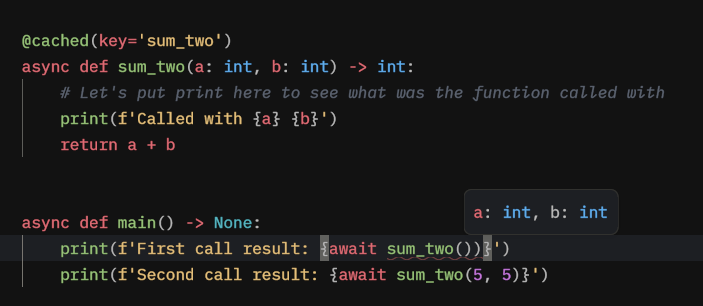
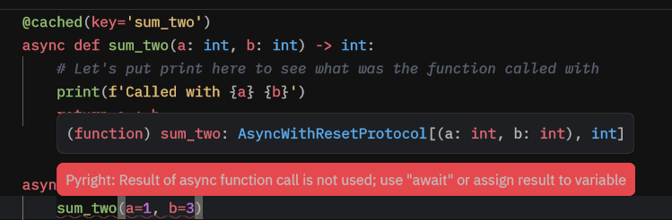

# Cached - First steps with py-cachify

Judging by the package's name py-cachify provides cache based utilities, so let's start by doing some simple caching :)

The initialization details could be found [here](../initial-setup/initialization.md).

For the sake of all the examples in here we will use the in-memory cache and an async environment, but everything will be the same for the sync one.

## Function to cache

Let's start by creating a function that we are about to cache:

```python
async def sum_two(a: int, b: int) -> int:
    # Let's put print here to see what was the function called with
    print(f'Called with {a} {b}')
    return a + b
```

So this function takes two integers and returns their sum.

## Introducing py-cachify

To cache a function all we have to do is wrap the function in the provided `@cached()` decorator.

Also we'll implement a simple main function to run our example, the full code will look something like this:

```python
import asyncio

from py_cachify import init_cachify, cached


# here we initializing a py-cachify to use an in-memory cache
init_cachify()


@cached(key='sum_two')
async def sum_two(a: int, b: int) -> int:
    # Let's put print here to see what was the function called with
    print(f'Called with {a} {b}')
    return a + b


async def main() -> None:
    print(f'First call result: {await sum_two(5, 5)}')
    print(f'Second call result: {await sum_two(5, 5)}')


if __name__ == '__main__':
    asyncio.run(main())
```


## Running the example

Now, let's run the example above.

<!-- termynal -->
```bash
# Run our example
$ python main.py

# The ouput should be
Called with 5 5
First call result: 10
Second call result: 10
```

So as you can see, the function result has been successfully cached on the first call,
and the second call to the function did not invoke an actual implementation and got it's result from cache.


## Type annotations

Py-Cachify is **fully** type annotated, this enhanced the developer experience and lets your IDE keep doing the work it is supposed to be doing.

As an example, our wrapped function keeps all it's type annotations and let's you keep writing the code comfortably.



And another example, in this case our <abbr title="Language Server Protocol">LSP</abbr> gives us the warning that we have forgotten to `await` the async function.



## What's next

Next we will utilize the dynamic cache key to create cache results based on function arguments.
