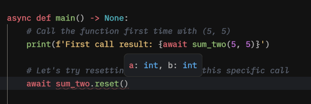

# Cached - Manually resetting cache with ///reset()/// method

## How to

Now it's time to see some ✨magic✨ happen.

You could've wondered:

What if I need to manually reset the cache on something I have cached using the `@cached` decorator?
Do I have to go all the way to my actual cache client and do the reset myself? How can I reset a dynamic key with certain arguments?

Don't worry py-cachify has got you covered.

## Introducing ///reset()///

Every time you wrap something with the provided decorators that py-cachify has, there is a method attached to the function you are wrapping.

Also, the method attached has the same type as the original function, so if it was async, the reset method will be async or the other way around for a sync function.

`reset()` **has the same signature** as your declared function, this way you can easily reset even the dynamic key with no issues.

## Changing our example

Let's modify the code we ran previously in the dynamic keys introduction:

```python
import asyncio

from py_cachify import init_cachify, cached


# here we are initializing py-cachify to use an in-memory cache
init_cachify()


# nothing is changing in declaration
@cached(key='sum_two-{a}-{b}')
async def sum_two(a: int, b: int) -> int:
    # Let's put print here to see what was the function called with
    print(f'Called with {a} {b}')
    return a + b


async def main() -> None:
    # Call the function first time with (5, 5)
    print(f'First call result: {await sum_two(5, 5)}')

    # Let's try resetting the cache for this specific call
    await sum_two.reset(a=5, b=5)

    # And then call the function again to see what will happen
    print(f'Second call result: {await sum_two(5, 5)}')


if __name__ == '__main__':
    asyncio.run(main())
```

We have added the reset call for a specific signature.

Let's now run it and see the output:

After running the example:
<!-- termynal -->
```bash
# Run our example
$ python main.py

# The ouput will be
Called with 5 5
First call result: 10
Called with 5 5
Second call result: 10

```

And you can see that the cache has been reset between the two calls we have.

## Type annotations

The `reset()` function has the same signature as the original function, which is nice and allows your IDE to help you with inline hints and errors:



## Conclusion

This concludes our tutorial for the `@cached()` decorator.

Next, we'll learn about the locks and a handy decorator that will help you incorporate locking logic without a headache.
