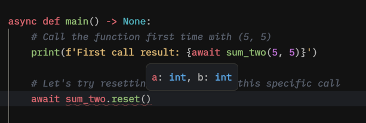

# Cached - Manually resetting cache with ///reset()/// method

## How to

Now it's time to see some ✨magic✨ happen.

You could've wondered:

What if I need to manually reset the cache on something I have cached using the `@cached` decorator?
Do I have to go all the way to my actual cache client and do the reset myself? How can I reset a dynamic key with certain arguments?

Don't worry py-cachify has got you covered.

## Introducing ///reset()///

Every time you wrap something with the provided decorators that py-cachify has, there is a method attached to the function you are wrapping.

Also, the method attached has the same type as the original function, so if it was async, the reset method will be async or the other way around for a sync function.

`reset()` **has the same signature** as your declared function, this way you can easily reset even the dynamic key with no issues.

## Changing our example

Let's modify the code we ran previously in the dynamic keys introduction:

```python
import asyncio

from py_cachify import init_cachify, cached


# here we are initializing py-cachify to use an in-memory cache
init_cachify()


# nothing is changing in declaration
@cached(key='sum_two-{a}-{b}')
async def sum_two(a: int, b: int) -> int:
    # Let's put print here to see what was the function called with
    print(f'Called with {a} {b}')
    return a + b


async def main() -> None:
    # Call the function first time with (5, 5)
    print(f'First call result: {await sum_two(5, 5)}')

    # Let's try resetting the cache for this specific call
    await sum_two.reset(a=5, b=5)

    # And then call the function again to see what will happen
    print(f'Second call result: {await sum_two(5, 5)}')


if __name__ == '__main__':
    asyncio.run(main())
```

We have added the reset call for a specific signature.

Let's now run it and see the output:

After running the example:
<!-- termynal -->
```bash
# Run our example
$ python main.py

# The ouput will be
Called with 5 5
First call result: 10
Called with 5 5
Second call result: 10

```

And you can see that the cache has been reset between the two calls we have.

## Instance-based reset

So far we have only used the **global** `@cached` decorator that relies on the globally initialized client.

In more advanced scenarios you might want a dedicated cache instance (for example, for a specific module or subsystem) that you can reset independently from the global one. For that, you can create a local `Cachify` instance using `init_cachify(is_global=False)` and call `reset()` on the wrapped function in exactly the same way.

```python
import asyncio

from py_cachify import init_cachify


# global initialization for the top-level decorators
init_cachify()


# local instance that does NOT touch the global client
local_cachify = init_cachify(is_global=False, prefix='LOCAL-')


@local_cachify.cached(key='local-sum_two-{a}-{b}')
async def local_sum_two(a: int, b: int) -> int:
    print(f'LOCAL called with {a} {b}')
    return a + b


async def main() -> None:
    print(f'First local call: {await local_sum_two(1, 2)}')
    print(f'Second local call: {await local_sum_two(1, 2)}')

    # Reset only the local cache entry for these arguments
    await local_sum_two.reset(a=1, b=2)

    print(f'Third local call after reset: {await local_sum_two(1, 2)}')


if __name__ == '__main__':
    asyncio.run(main())
```

Here:

- `local_sum_two` uses the dedicated instance configured via `local_cachify`.
- `local_sum_two.reset(...)` operates only on that instance’s cache and has no effect on any globally cached functions.
- The method signature is still the same as the original function.

## Multi-layer reset

You can also create **multi-layer** caching by stacking a local instance’s `cached` decorator on top of the global `@cached`. In that case, calling `reset()` on the stacked function will clear both layers for the given arguments.

```python
import asyncio

from py_cachify import init_cachify, cached


# global initialization for the top-level decorators
init_cachify()


# local instance providing a short-lived layer over the global cache
local_cachify = init_cachify(is_global=False, prefix='LOCAL-')


@local_cachify.cached(key='local-sum_two-{a}-{b}', ttl=5)
@cached(key='sum_two-{a}-{b}', ttl=60)
async def sum_two(a: int, b: int) -> int:
    print(f'GLOBAL called with {a} {b}')
    return a + b


async def main() -> None:
    # First call: computes and populates both inner and outer caches
    print(f'First layered call: {await sum_two(2, 3)}')
    # Second call: hits outer cache only, no extra prints
    print(f'Second layered call: {await sum_two(2, 3)}')

    # Reset both local and global layers for these args
    await sum_two.reset(a=2, b=3)

    # After reset, both caches are clear for (2, 3), so the inner function is executed again
    print(f'Third layered call after reset: {await sum_two(2, 3)}')


if __name__ == '__main__':
    asyncio.run(main())
```

This pattern lets you compose multiple caches with different TTLs or backends while keeping the `reset()` API simple and predictable.

## Type annotations

The `reset()` function has the same signature as the original function, which is nice and allows your IDE to help you with inline hints and errors:



## Conclusion

This concludes our tutorial for the `@cached()` decorator.

Next, we'll learn about the locks and a handy decorator that will help you incorporate locking logic without a headache.
